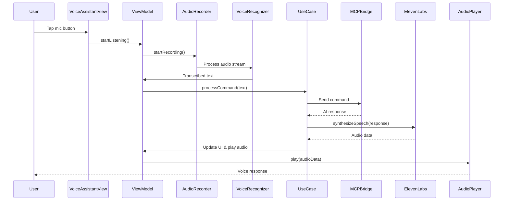
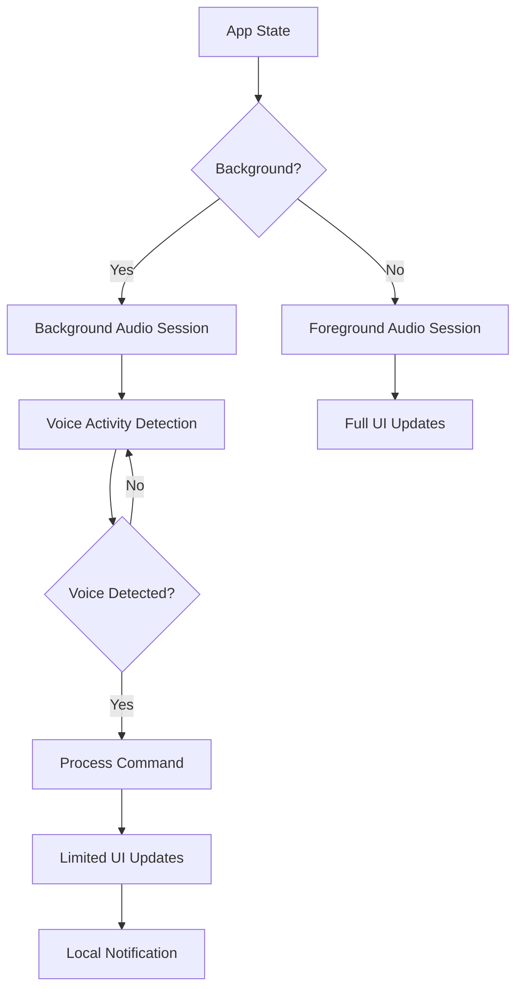

# JARVIS iOS Voice Assistant - Architecture Documentation

## Table of Contents
1. [Project Overview](#project-overview)
2. [Architecture Overview](#architecture-overview)
3. [Module Structure](#module-structure)
4. [Data Flow](#data-flow)
5. [Core Components](#core-components)
6. [Implementation Guide](#implementation-guide)
7. [Security Considerations](#security-considerations)
8. [Offline Capabilities](#offline-capabilities)

## Project Overview

### Vision
A sophisticated iOS voice assistant inspired by JARVIS, featuring:
- Natural voice interactions using ElevenLabs API
- Real-time voice processing and visualization
- MCP (Model Context Protocol) server integration
- Secure API key management
- Background audio processing
- Offline capabilities

### Technology Stack
- **UI Framework**: SwiftUI
- **Architecture Pattern**: Clean Architecture + MVVM
- **Voice Synthesis**: ElevenLabs API
- **Networking**: URLSession + Combine
- **Persistence**: Core Data + Keychain
- **Audio Processing**: AVFoundation + Accelerate
- **Dependency Injection**: Swift Package Manager

## Architecture Overview

```
┌─────────────────────────────────────────────────────────────────┐
│                        Presentation Layer                        │
├─────────────────────────────────────────────────────────────────┤
│  Views (SwiftUI)  │  ViewModels  │  Coordinators  │  Routers   │
├─────────────────────────────────────────────────────────────────┤
│                         Domain Layer                             │
├─────────────────────────────────────────────────────────────────┤
│  Use Cases  │  Entities  │  Repository Protocols  │  Services  │
├─────────────────────────────────────────────────────────────────┤
│                          Data Layer                              │
├─────────────────────────────────────────────────────────────────┤
│  Repositories  │  Data Sources  │  DTOs  │  Mappers  │  Cache  │
├─────────────────────────────────────────────────────────────────┤
│                      Infrastructure Layer                        │
├─────────────────────────────────────────────────────────────────┤
│  Network  │  Audio  │  Storage  │  Security  │  MCP Bridge     │
└─────────────────────────────────────────────────────────────────┘
```

## Module Structure

```
JARVIS/
├── App/
│   ├── JARVISApp.swift
│   ├── AppDelegate.swift
│   ├── SceneDelegate.swift
│   └── Configuration/
│       ├── AppConfiguration.swift
│       └── Environment.swift
│
├── Core/
│   ├── Common/
│   │   ├── Extensions/
│   │   ├── Utilities/
│   │   └── Constants/
│   ├── Network/
│   │   ├── NetworkManager.swift
│   │   ├── NetworkError.swift
│   │   └── Endpoints/
│   ├── Storage/
│   │   ├── KeychainManager.swift
│   │   ├── CoreDataStack.swift
│   │   └── UserDefaultsManager.swift
│   └── Security/
│       ├── BiometricAuthManager.swift
│       └── EncryptionManager.swift
│
├── Features/
│   ├── VoiceAssistant/
│   │   ├── Presentation/
│   │   │   ├── Views/
│   │   │   │   ├── VoiceAssistantView.swift
│   │   │   │   ├── WaveformView.swift
│   │   │   │   └── ConversationView.swift
│   │   │   ├── ViewModels/
│   │   │   │   ├── VoiceAssistantViewModel.swift
│   │   │   │   └── ConversationViewModel.swift
│   │   │   └── Components/
│   │   ├── Domain/
│   │   │   ├── UseCases/
│   │   │   │   ├── ProcessVoiceCommandUseCase.swift
│   │   │   │   ├── SynthesizeSpeechUseCase.swift
│   │   │   │   └── ManageConversationUseCase.swift
│   │   │   ├── Entities/
│   │   │   │   ├── VoiceCommand.swift
│   │   │   │   ├── Conversation.swift
│   │   │   │   └── AIResponse.swift
│   │   │   └── Repositories/
│   │   │       ├── VoiceRepositoryProtocol.swift
│   │   │       └── ConversationRepositoryProtocol.swift
│   │   └── Data/
│   │       ├── Repositories/
│   │       │   ├── VoiceRepository.swift
│   │       │   └── ConversationRepository.swift
│   │       ├── DataSources/
│   │       │   ├── Remote/
│   │       │   │   ├── ElevenLabsAPI.swift
│   │       │   │   └── MCPServerAPI.swift
│   │       │   └── Local/
│   │       │       ├── ConversationCache.swift
│   │       │       └── VoiceCache.swift
│   │       └── DTOs/
│   │           ├── ElevenLabsResponseDTO.swift
│   │           └── MCPResponseDTO.swift
│   │
│   ├── Settings/
│   │   ├── Presentation/
│   │   │   ├── Views/
│   │   │   └── ViewModels/
│   │   └── Domain/
│   │
│   └── Onboarding/
│       ├── Presentation/
│       └── Domain/
│
├── Services/
│   ├── Audio/
│   │   ├── AudioEngine.swift
│   │   ├── AudioRecorder.swift
│   │   ├── AudioPlayer.swift
│   │   ├── WaveformProcessor.swift
│   │   └── BackgroundAudioSession.swift
│   ├── Voice/
│   │   ├── VoiceSynthesizer.swift
│   │   ├── VoiceRecognizer.swift
│   │   └── VoiceActivityDetector.swift
│   ├── AI/
│   │   ├── ElevenLabsService.swift
│   │   ├── MCPBridge.swift
│   │   └── ConversationManager.swift
│   └── Analytics/
│       └── AnalyticsService.swift
│
├── Resources/
│   ├── Assets.xcassets/
│   ├── Localizations/
│   ├── Fonts/
│   └── Sounds/
│
└── Tests/
    ├── UnitTests/
    ├── IntegrationTests/
    └── UITests/
```

## Data Flow

### 1. Voice Command Processing Flow


### 2. Background Processing Flow


## Core Components

### 1. Voice Assistant View Model
```swift
@MainActor
class VoiceAssistantViewModel: ObservableObject {
    @Published var isListening = false
    @Published var transcribedText = ""
    @Published var aiResponse = ""
    @Published var audioLevels: [Float] = []
    @Published var conversationHistory: [ConversationEntry] = []
    
    private let processVoiceCommandUseCase: ProcessVoiceCommandUseCase
    private let synthesizeSpeechUseCase: SynthesizeSpeechUseCase
    private let audioRecorder: AudioRecorder
    private let voiceRecognizer: VoiceRecognizer
    
    private var cancellables = Set<AnyCancellable>()
    
    init(
        processVoiceCommandUseCase: ProcessVoiceCommandUseCase,
        synthesizeSpeechUseCase: SynthesizeSpeechUseCase,
        audioRecorder: AudioRecorder,
        voiceRecognizer: VoiceRecognizer
    ) {
        self.processVoiceCommandUseCase = processVoiceCommandUseCase
        self.synthesizeSpeechUseCase = synthesizeSpeechUseCase
        self.audioRecorder = audioRecorder
        self.voiceRecognizer = voiceRecognizer
        
        setupBindings()
    }
    
    func startListening() {
        Task {
            await audioRecorder.startRecording()
            isListening = true
        }
    }
    
    func stopListening() {
        Task {
            await audioRecorder.stopRecording()
            isListening = false
            await processCommand()
        }
    }
    
    private func processCommand() async {
        guard !transcribedText.isEmpty else { return }
        
        do {
            let response = try await processVoiceCommandUseCase.execute(command: transcribedText)
            aiResponse = response.text
            
            let audioData = try await synthesizeSpeechUseCase.execute(text: response.text)
            await playAudioResponse(audioData)
            
            updateConversationHistory()
        } catch {
            handleError(error)
        }
    }
}
```

### 2. ElevenLabs Service Implementation
```swift
class ElevenLabsService: VoiceSynthesizerProtocol {
    private let networkManager: NetworkManager
    private let apiKey: String
    private let voiceId: String
    
    init(networkManager: NetworkManager, apiKey: String, voiceId: String) {
        self.networkManager = networkManager
        self.apiKey = apiKey
        self.voiceId = voiceId
    }
    
    func synthesizeSpeech(text: String, settings: VoiceSettings) async throws -> Data {
        let endpoint = ElevenLabsEndpoint.textToSpeech(
            voiceId: voiceId,
            text: text,
            settings: settings
        )
        
        let request = try buildRequest(for: endpoint)
        let (data, response) = try await networkManager.data(for: request)
        
        guard let httpResponse = response as? HTTPURLResponse,
              httpResponse.statusCode == 200 else {
            throw VoiceSynthesisError.invalidResponse
        }
        
        return data
    }
    
    private func buildRequest(for endpoint: ElevenLabsEndpoint) throws -> URLRequest {
        var request = URLRequest(url: endpoint.url)
        request.httpMethod = endpoint.method
        request.setValue("application/json", forHTTPHeaderField: "Content-Type")
        request.setValue(apiKey, forHTTPHeaderField: "xi-api-key")
        request.httpBody = try endpoint.body
        return request
    }
}
```

### 3. MCP Bridge Implementation
```swift
class MCPBridge: MCPServerProtocol {
    private let serverURL: URL
    private let session: URLSession
    private let messageQueue = DispatchQueue(label: "mcp.bridge.queue")
    
    init(serverURL: URL, session: URLSession = .shared) {
        self.serverURL = serverURL
        self.session = session
    }
    
    func sendCommand(_ command: MCPCommand) async throws -> MCPResponse {
        let encoder = JSONEncoder()
        let requestData = try encoder.encode(command)
        
        var request = URLRequest(url: serverURL)
        request.httpMethod = "POST"
        request.setValue("application/json", forHTTPHeaderField: "Content-Type")
        request.httpBody = requestData
        
        let (data, response) = try await session.data(for: request)
        
        guard let httpResponse = response as? HTTPURLResponse,
              httpResponse.statusCode == 200 else {
            throw MCPError.serverError
        }
        
        let decoder = JSONDecoder()
        return try decoder.decode(MCPResponse.self, from: data)
    }
    
    func establishConnection() async throws {
        // WebSocket or persistent connection implementation
    }
}
```

### 4. Audio Visualization Component
```swift
struct WaveformView: View {
    @ObservedObject var audioProcessor: AudioProcessor
    
    var body: some View {
        GeometryReader { geometry in
            Path { path in
                let width = geometry.size.width
                let height = geometry.size.height
                let barWidth = width / CGFloat(audioProcessor.levels.count)
                
                for (index, level) in audioProcessor.levels.enumerated() {
                    let x = CGFloat(index) * barWidth
                    let barHeight = CGFloat(level) * height
                    let y = (height - barHeight) / 2
                    
                    path.addRoundedRect(
                        in: CGRect(x: x, y: y, width: barWidth - 2, height: barHeight),
                        cornerSize: CGSize(width: 2, height: 2)
                    )
                }
            }
            .fill(LinearGradient(
                colors: [.blue, .purple],
                startPoint: .bottom,
                endPoint: .top
            ))
            .animation(.easeInOut(duration: 0.1), value: audioProcessor.levels)
        }
    }
}
```

## Implementation Guide

### Phase 1: Core Infrastructure (Week 1-2)
1. Set up project structure and dependencies
2. Implement core networking layer
3. Set up secure storage (Keychain, Core Data)
4. Create basic UI skeleton with SwiftUI

### Phase 2: Audio Processing (Week 3-4)
1. Implement AudioEngine with AVFoundation
2. Create voice recording functionality
3. Integrate speech recognition
4. Build waveform visualization

### Phase 3: AI Integration (Week 5-6)
1. Implement ElevenLabs API integration
2. Create MCP server bridge
3. Build conversation management
4. Implement response caching

### Phase 4: Advanced Features (Week 7-8)
1. Add background processing
2. Implement offline capabilities
3. Create custom voice profiles
4. Add contextual awareness

### Phase 5: Polish & Testing (Week 9-10)
1. UI/UX refinements
2. Performance optimization
3. Comprehensive testing
4. Security audit

## Security Considerations

### 1. API Key Management
```swift
class SecureConfigurationManager {
    private let keychain = KeychainWrapper.standard
    private let encryptionKey: SymmetricKey
    
    private enum Keys {
        static let elevenLabsAPIKey = "com.jarvis.elevenlabs.apikey"
        static let mcpServerToken = "com.jarvis.mcp.token"
        static let encryptionSalt = "com.jarvis.encryption.salt"
    }
    
    init() throws {
        // Generate or retrieve encryption key
        if let existingKey = keychain.data(forKey: Keys.encryptionSalt) {
            self.encryptionKey = SymmetricKey(data: existingKey)
        } else {
            self.encryptionKey = SymmetricKey(size: .bits256)
            keychain.set(encryptionKey.withUnsafeBytes { Data($0) }, forKey: Keys.encryptionSalt)
        }
    }
    
    func setElevenLabsAPIKey(_ apiKey: String) throws {
        let encrypted = try encrypt(apiKey)
        keychain.set(encrypted, forKey: Keys.elevenLabsAPIKey)
    }
    
    func getElevenLabsAPIKey() throws -> String {
        guard let encryptedData = keychain.data(forKey: Keys.elevenLabsAPIKey) else {
            throw SecurityError.keyNotFound
        }
        return try decrypt(encryptedData)
    }
    
    private func encrypt(_ string: String) throws -> Data {
        let data = Data(string.utf8)
        let sealedBox = try AES.GCM.seal(data, using: encryptionKey)
        return sealedBox.combined!
    }
    
    private func decrypt(_ data: Data) throws -> String {
        let sealedBox = try AES.GCM.SealedBox(combined: data)
        let decryptedData = try AES.GCM.open(sealedBox, using: encryptionKey)
        return String(data: decryptedData, encoding: .utf8)!
    }
}
```

### 2. Biometric Authentication
```swift
class BiometricAuthManager {
    private let context = LAContext()
    
    func authenticateUser() async throws {
        var error: NSError?
        
        guard context.canEvaluatePolicy(.deviceOwnerAuthenticationWithBiometrics, error: &error) else {
            throw AuthenticationError.biometricsNotAvailable
        }
        
        let reason = "Authenticate to access JARVIS"
        
        do {
            let success = try await context.evaluatePolicy(
                .deviceOwnerAuthenticationWithBiometrics,
                localizedReason: reason
            )
            
            if !success {
                throw AuthenticationError.authenticationFailed
            }
        } catch {
            throw AuthenticationError.authenticationFailed
        }
    }
}
```

### 3. Network Security
```swift
class SecureNetworkManager {
    private let session: URLSession
    
    init() {
        let configuration = URLSessionConfiguration.default
        configuration.tlsMinimumSupportedProtocolVersion = .TLSv12
        configuration.requestCachePolicy = .reloadIgnoringLocalCacheData
        
        // Certificate pinning
        let serverTrustPolicy = ServerTrustPolicy(
            validateHost: true,
            certificatePinning: .publicKeys(keys: PublicKeys.elevenLabs)
        )
        
        self.session = URLSession(
            configuration: configuration,
            delegate: SecurityDelegate(serverTrustPolicy: serverTrustPolicy),
            delegateQueue: nil
        )
    }
}
```

## Offline Capabilities

### 1. Offline Mode Architecture
```swift
class OfflineManager {
    private let cacheManager: CacheManager
    private let syncManager: SyncManager
    private let reachability: NetworkReachability
    
    @Published var isOfflineMode = false
    
    init(cacheManager: CacheManager, syncManager: SyncManager, reachability: NetworkReachability) {
        self.cacheManager = cacheManager
        self.syncManager = syncManager
        self.reachability = reachability
        
        setupReachabilityObserver()
    }
    
    private func setupReachabilityObserver() {
        reachability.connectionPublisher
            .sink { [weak self] connection in
                self?.isOfflineMode = connection == .unavailable
                if connection != .unavailable {
                    Task {
                        await self?.syncManager.syncPendingData()
                    }
                }
            }
            .store(in: &cancellables)
    }
}
```

### 2. Local Speech Processing
```swift
class LocalSpeechProcessor {
    private let speechRecognizer: SFSpeechRecognizer
    private let naturalLanguage: NLTagger
    
    init() {
        self.speechRecognizer = SFSpeechRecognizer(locale: Locale(identifier: "en-US"))!
        self.naturalLanguage = NLTagger(tagSchemes: [.nameType, .lexicalClass])
    }
    
    func processOfflineCommand(_ audioURL: URL) async throws -> LocalCommandResult {
        // Use on-device speech recognition
        let request = SFSpeechURLRecognitionRequest(url: audioURL)
        let result = try await speechRecognizer.recognitionTask(with: request)
        
        // Process with Natural Language framework
        let text = result.bestTranscription.formattedString
        return try processText(text)
    }
    
    private func processText(_ text: String) throws -> LocalCommandResult {
        naturalLanguage.string = text
        
        // Extract intent and entities
        var entities: [String: String] = [:]
        naturalLanguage.enumerateTags(in: text.startIndex..<text.endIndex, unit: .word, scheme: .nameType) { tag, range in
            if let tag = tag {
                entities[String(text[range])] = tag.rawValue
            }
            return true
        }
        
        // Match against local command patterns
        let intent = matchIntent(text)
        
        return LocalCommandResult(intent: intent, entities: entities, confidence: 0.8)
    }
}
```

### 3. Cached Response System
```swift
class ResponseCacheManager {
    private let coreDataStack: CoreDataStack
    private let maxCacheSize: Int = 100 // MB
    private let cacheExpiration: TimeInterval = 7 * 24 * 60 * 60 // 7 days
    
    func cacheResponse(_ response: AIResponse, for command: String) async throws {
        let context = coreDataStack.backgroundContext
        
        await context.perform {
            let cachedResponse = CachedResponse(context: context)
            cachedResponse.command = command
            cachedResponse.responseText = response.text
            cachedResponse.audioData = response.audioData
            cachedResponse.timestamp = Date()
            cachedResponse.confidence = response.confidence
            
            try context.save()
        }
        
        // Clean up old cache entries
        await cleanupExpiredCache()
    }
    
    func getCachedResponse(for command: String) async -> AIResponse? {
        let context = coreDataStack.viewContext
        let request = CachedResponse.fetchRequest()
        
        // Use fuzzy matching for similar commands
        request.predicate = NSPredicate(
            format: "command CONTAINS[cd] %@ AND timestamp > %@",
            command,
            Date().addingTimeInterval(-cacheExpiration) as NSDate
        )
        request.sortDescriptors = [NSSortDescriptor(key: "confidence", ascending: false)]
        request.fetchLimit = 1
        
        do {
            let results = try context.fetch(request)
            return results.first?.toAIResponse()
        } catch {
            return nil
        }
    }
}
```

## Advanced Features

### 1. Contextual Awareness
```swift
class ContextManager {
    private let locationManager: CLLocationManager
    private let calendarManager: EKEventStore
    private let healthManager: HKHealthStore
    
    struct UserContext {
        let location: CLLocation?
        let timeOfDay: TimeOfDay
        let upcomingEvents: [EKEvent]
        let activityLevel: ActivityLevel
        let previousCommands: [String]
    }
    
    func getCurrentContext() async throws -> UserContext {
        async let location = getCurrentLocation()
        async let events = getUpcomingEvents()
        async let activity = getCurrentActivity()
        
        return try await UserContext(
            location: location,
            timeOfDay: TimeOfDay.current,
            upcomingEvents: events,
            activityLevel: activity,
            previousCommands: CommandHistory.shared.recent(5)
        )
    }
}
```

### 2. Custom Voice Profiles
```swift
class VoiceProfileManager {
    struct VoiceProfile {
        let id: UUID
        let name: String
        let elevenLabsVoiceId: String
        let speechRate: Float
        let pitch: Float
        let stability: Float
        let similarityBoost: Float
    }
    
    private var profiles: [VoiceProfile] = []
    @Published var activeProfile: VoiceProfile?
    
    func createCustomProfile(name: String, baseVoiceId: String) async throws -> VoiceProfile {
        let profile = VoiceProfile(
            id: UUID(),
            name: name,
            elevenLabsVoiceId: baseVoiceId,
            speechRate: 1.0,
            pitch: 1.0,
            stability: 0.75,
            similarityBoost: 0.75
        )
        
        profiles.append(profile)
        try await saveProfiles()
        
        return profile
    }
}
```

### 3. Intelligent Response Caching
```swift
class IntelligentCache {
    private let mlModel: ResponsePredictionModel
    private let cache: ResponseCacheManager
    
    func shouldCacheResponse(_ response: AIResponse, for command: String) -> Bool {
        // Use ML model to predict if response is likely to be reused
        let features = extractFeatures(from: command, response: response)
        let prediction = mlModel.predict(features)
        
        return prediction.reuseProbabiity > 0.7
    }
    
    func findBestCachedResponse(for command: String, context: UserContext) async -> AIResponse? {
        let candidates = await cache.getSimilarResponses(to: command)
        
        // Score candidates based on context similarity
        let scored = candidates.map { candidate in
            let score = calculateContextSimilarity(candidate.context, context)
            return (candidate, score)
        }
        
        // Return best match if score is high enough
        let best = scored.max { $0.1 < $1.1 }
        return best?.1 > 0.8 ? best?.0.response : nil
    }
}
```

## Performance Optimization

### 1. Audio Streaming
```swift
class AudioStreamManager {
    private let audioEngine = AVAudioEngine()
    private let bufferSize: AVAudioFrameCount = 1024
    
    func streamAudioResponse(_ dataStream: AsyncStream<Data>) async {
        let playerNode = AVAudioPlayerNode()
        audioEngine.attach(playerNode)
        
        let format = AVAudioFormat(standardFormatWithSampleRate: 24000, channels: 1)!
        audioEngine.connect(playerNode, to: audioEngine.mainMixerNode, format: format)
        
        do {
            try audioEngine.start()
            playerNode.play()
            
            for await chunk in dataStream {
                if let buffer = chunk.toAudioBuffer(format: format) {
                    playerNode.scheduleBuffer(buffer)
                }
            }
        } catch {
            print("Audio streaming error: \(error)")
        }
    }
}
```

### 2. Response Preloading
```swift
class ResponsePreloader {
    private let predictor: CommandPredictor
    private let synthesizer: VoiceSynthesizer
    
    func preloadLikelyResponses(basedOn currentCommand: String) async {
        let predictions = predictor.predictNextCommands(after: currentCommand)
        
        await withTaskGroup(of: Void.self) { group in
            for prediction in predictions.prefix(3) {
                group.addTask {
                    if let response = await self.generateResponse(for: prediction.command) {
                        await self.cacheResponse(response, for: prediction.command)
                    }
                }
            }
        }
    }
}
```

## Testing Strategy

### 1. Unit Test Example
```swift
class VoiceAssistantViewModelTests: XCTestCase {
    var sut: VoiceAssistantViewModel!
    var mockUseCase: MockProcessVoiceCommandUseCase!
    var mockAudioRecorder: MockAudioRecorder!
    
    override func setUp() {
        super.setUp()
        mockUseCase = MockProcessVoiceCommandUseCase()
        mockAudioRecorder = MockAudioRecorder()
        
        sut = VoiceAssistantViewModel(
            processVoiceCommandUseCase: mockUseCase,
            synthesizeSpeechUseCase: MockSynthesizeSpeechUseCase(),
            audioRecorder: mockAudioRecorder,
            voiceRecognizer: MockVoiceRecognizer()
        )
    }
    
    func testStartListeningUpdatesState() async {
        // Given
        XCTAssertFalse(sut.isListening)
        
        // When
        await sut.startListening()
        
        // Then
        XCTAssertTrue(sut.isListening)
        XCTAssertTrue(mockAudioRecorder.isRecording)
    }
}
```

### 2. Integration Test Example
```swift
class ElevenLabsIntegrationTests: XCTestCase {
    func testVoiceSynthesis() async throws {
        // Given
        let service = ElevenLabsService(
            networkManager: NetworkManager(),
            apiKey: TestConfiguration.elevenLabsAPIKey,
            voiceId: TestConfiguration.testVoiceId
        )
        
        // When
        let audioData = try await service.synthesizeSpeech(
            text: "Hello, this is a test.",
            settings: VoiceSettings.default
        )
        
        // Then
        XCTAssertFalse(audioData.isEmpty)
        XCTAssertGreaterThan(audioData.count, 1000) // Audio should have substantial data
    }
}
```

## Deployment Considerations

1. **App Store Guidelines**
   - Ensure proper privacy policy for voice data
   - Implement age gate if required
   - Handle microphone permissions gracefully

2. **Performance Requirements**
   - Target 60 FPS for UI animations
   - Voice response latency < 500ms
   - Memory usage < 200MB in active use

3. **Accessibility**
   - Full VoiceOver support
   - Dynamic Type support
   - Reduced motion options

4. **Analytics Integration**
   - Track voice command success rate
   - Monitor API latency
   - User engagement metrics

This architecture provides a solid foundation for building a sophisticated JARVIS-inspired voice assistant that is scalable, maintainable, and delivers an exceptional user experience.